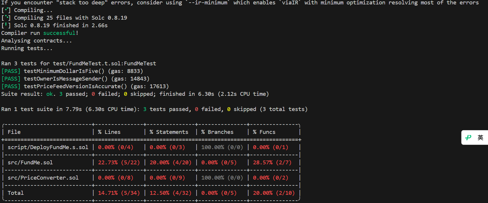

# Part1.

## install package

`install smart-contract locally`

```bash
forge install smartcontractkit/chainlink-brownie-contracts@1.3.0 --no-commit
```

`modify toml`

```toml
remappings = ['@chainlink/contracts/=lib/chainlink-brownie-contracts/contracts/']
```

## forge

### `test`

`test command`

```bash
forge test
# test for log
forge test -vv
# test single on test
forge test --match-test testPriceFeedVersionIsAccurate -vvv # this would fail because we are on anvilTest,not sepolia
# test single on fork(which means we are working on sepolia,with our alchemy sepolia-rpc-url)
source .env
# it will pretend to work on the sepolia chain instead of anvilTest
forge test --match-test testPriceFeedVersionIsAccurate -vvvv --fork-url $SEPOLIA_RPC_URL # it failed,unexpectedly
# we can see how much lines code we actually run,did we success or fail
forge coverage --fork-url $SEPOLIA_RPC_URL
```

** images **
`forge coverage --fork-url $SEPOLIA_RPC_URL`


```bash
# 1. try to figure out what's wrong
# 1.1 this failed
# for compatibility reasons,we use both upper and lower case
export http_proxy=http://127.0.0.1:1080
export https_proxy=http://127.0.0.1:1080
curl -s https://httpbin.org/ip
# 1.2 this succeed
# this means that we tell wsl and all tools that follow the standard proxy variables,
# for 'eth-sepolia.g.alchemy.com',do not use the system proxy,and access it directly.
# for compatibility reasons,we use both upper and lower case
export no_proxy="eth-sepolia.g.alchemy.com"
export NO_PROXY="eth-sepolia.g.alchemy.com"
```

### `deploy`

```bash
# deploy command
forge script script/DeployFundMe.s.sol
```
