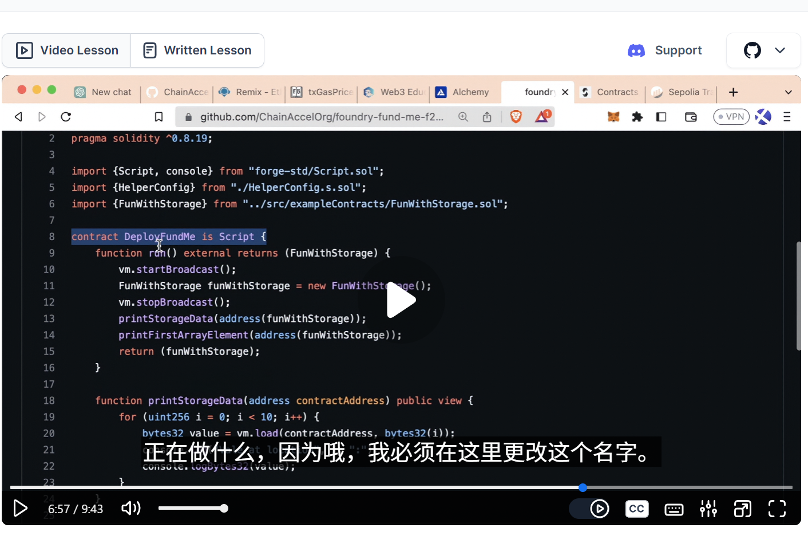
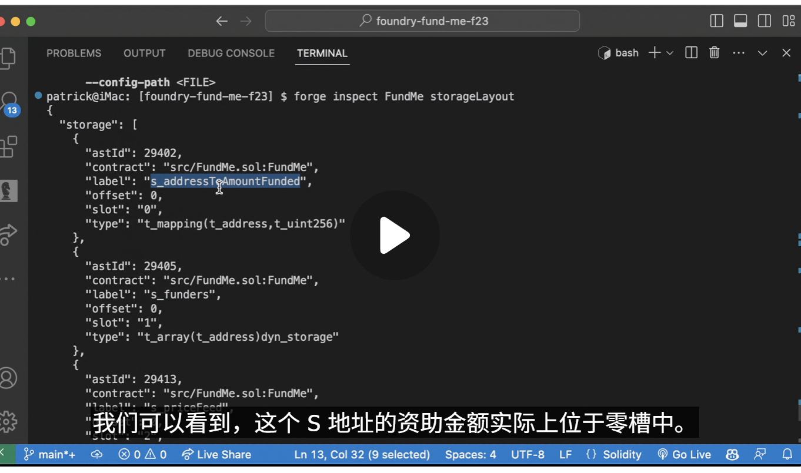
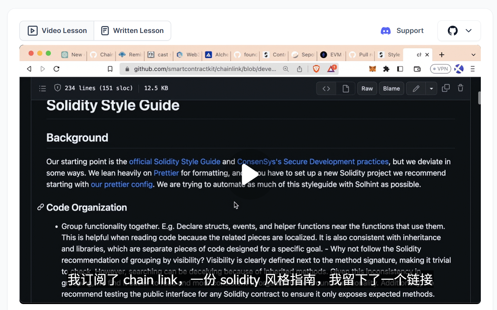
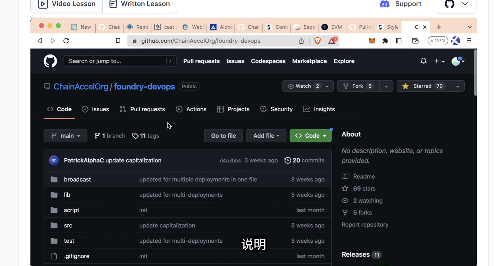
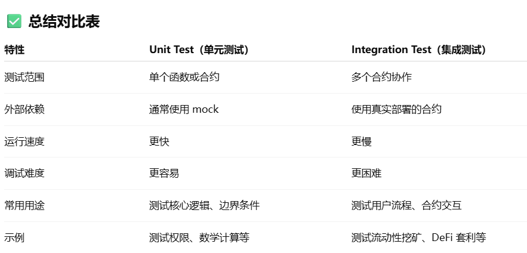

# part2.

## Saving Gas

```bash
# generate ga s snap ,to tell the gas a functions cost
forge snapshot -m testWithdrawFromMultipleFunders

```

```solidity
// txGasPrice pretend we are working on the production env,using real gas
uint 256 gasStart = gasLeft();// 1000
vm.txGasPrice();
doSomething();// c:200
uint256 gasEnd = gasLeft();// 800
uint256 gasUsed = (gasStart - gasEnd) * tx.gasprice
console.log(gasUsd)
```

## Storage

Play storage game,anvil it and see where the storage it is,log it,



```bash
# print some info contain storage
forge inspect FundMe storageLayout
# or anvil and cast
anvil
forge script Contract
cast storage address(Contract) $storage_slut
# ⬆️ then it would cast some storage info
# even private variable can be accessed this way
```



## How to name a variable properly?Read this guide



## DevOps

```bash
forge install ChainAccelOrg/foundry-devops
```



## Unit & Integration tests

### test/unit/\*.t.sol

-   `TokenTest.t.sol` - 单元测试: 代币行为、mint、transfer。
-   `AccessControlTest.t.sol` - 单元测试: 角色授权、onlyOwner 检查。

### test/integration/\*.t.sol

-   `StakingSystemTest.t.sol` - 集成测试: 用户 staking 流程、奖励领取。
-   `FullFlowTest.t.sol` - 集成测试: 多合约之间完整调用链验证。



## Makefile

-   automatically source the env
